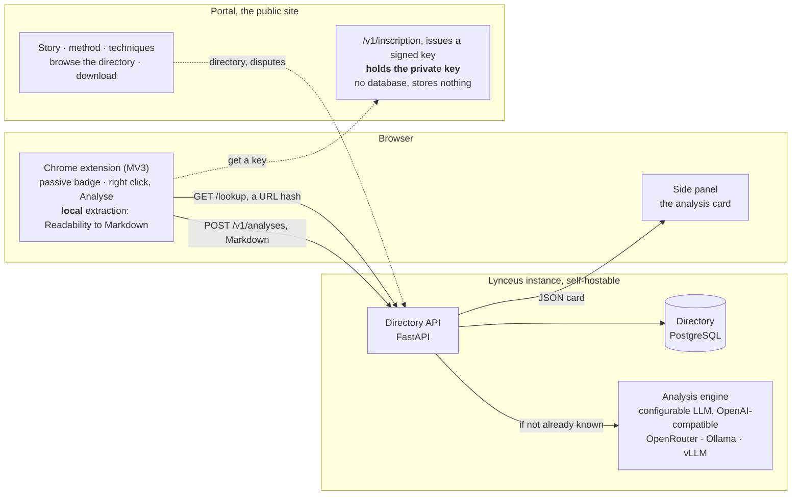

# Project Lynceus 🔭

**English** · [Français](README.fr.md)

> **The lookout for information.** Lynceus, lookout of the Argonauts, could see through the hulls of ships and through the earth itself. A lookout warns the crew; a lookout never takes the helm.

Lynceus analyses the content of a web page and explains to its reader, **without judging them**, the persuasion and manipulation techniques it uses: missing sources, appeals to fear, the rhetoric of secrecy, fake experts, undisclosed commercial interests. The whole thing is summed up by a trust index in the manner of a **Nutri-Score for information** (A to E), with the teaching detail one click away.

**A humanitarian project, entirely free software (AGPL-3.0), free of charge, self-hostable.**

## Install

**[→ Step-by-step installation guide](INSTALLATION.md)**: the extension alone, or the full kit (server plus extension), with or without Docker.

## Why?

Every one of us knows someone exposed to disinformation: pseudo-medicine, conspiracy theories, sectarian manipulation, fabricated articles. Contradicting them head-on does not work, and research shows it can even strengthen the belief (reactance).

What does work is **inoculation**: learning to recognise the *techniques* of manipulation, independently of the subject matter. Lynceus is not a ministry of truth. It is a media-literacy tool that shows the devices, quotes the passages, and lets the reader draw the conclusion.

## How it works




1. **Passive badge**: on every page, the extension queries the directory (a hash of the URL, no content sent). If the page has already been analysed, the grade appears on the toolbar icon. Can be turned off.
2. **Deliberate analysis**: right click, then "Analyse this page". The text is extracted *locally* (Readability), converted to Markdown and sent to the API. The side panel displays the analysis card.
3. **Shared directory**: each page is analysed once, for everyone. The same content copied onto another site is recognised (content hash). Domain by domain, a reliability profile builds up.
4. **Portal**: the public website. It presents the project, publishes the methodology, lets anyone browse the directory without installing anything, distributes the extension, and issues an access key in one click, with no account and no email address. It is a service **separate from the instance**: it alone holds the private key that signs access keys, so a compromised instance cannot forge any.

## The analysis card

Every analysis produces a JSON card ([schema](schema/carte-analyse.schema.json), [example](schema/exemples/pseudo-science.json)):

- **Category** of the content: information, opinion, satire, pseudo-science, faith-based content and so on.
- **Overall grade A to E**, computed by the server from 4 transparent dimensions: sources, factuality, tone, transparency.
- **Techniques detected**: each with the *verbatim* passage from the page and a plain explanation ([full taxonomy](docs/en/TAXONOMIE.md)).
- **Positive points**: always looked for, because fairness is a condition of credibility.
- **Questions to ask yourself**: socratic, so the reader stays the investigator.

## Non-negotiable principles

A summary of the [ethical charter](docs/en/ETHIQUE.md):

1. **A lookout, not a judge**: we describe methods, we do not judge beliefs.
2. **Radical transparency**: prompts, methodology, weightings and code are public and versioned.
3. **Deliberate scanning**: never an analysis without the user asking for it.
4. **Privacy**: no browsing history stored, no account required, lookup by hash.
5. **Fairness**: satire is not disinformation, an owned opinion is not manipulation, positive points are systematic.
6. **Acknowledged fallibility**: the analysis is produced by an AI, the confidence index is displayed, and every analysis can be disputed.

## Documentation

The documents below are the ones that bind the project. The French text is the original and prevails in case of divergence; the English translation is checked against it at every build, so it can never quietly fall behind.

| Document | Contents |
|---|---|
| [docs/en/ETHIQUE.md](docs/en/ETHIQUE.md) | The charter: posture, privacy, fairness, limits |
| [docs/en/METHODOLOGIE.md](docs/en/METHODOLOGIE.md) | Categories, dimensions, scale, how the grade is computed, special cases |
| [docs/en/TAXONOMIE.md](docs/en/TAXONOMIE.md) | The 31 techniques detected, documented and sourced |
| [docs/en/ARCHITECTURE.md](docs/en/ARCHITECTURE.md) | API, data model, deduplication, LLM layer, federation |
| [docs/en/CONFORMITE.md](docs/en/CONFORMITE.md) | What is processed, transmitted and kept, and under which legal basis |
| [docs/en/IA-GENERATIVE.md](docs/en/IA-GENERATIVE.md) | How generative AI is used to build the project |
| [prompts/](prompts/) | Versioned analysis prompts (public, like everything else) |
| [corpus/](corpus/) | Calibration corpus for the prompts |
| [api/DEPLOIEMENT.md](api/DEPLOIEMENT.md) | Hosting an instance and a portal: secrets, exposure, keys, costs, scaling |

## Stack

- **API and server**: Python, FastAPI, PostgreSQL. The self-hostable "kit" (Docker Compose).
- **Extension**: TypeScript, Manifest V3, Chrome side panel, extraction with Readability.js.
- **Portal**: the same Python package, a second entry point (`lynceus.portail`). Jinja2 and htmx, no resource loaded from a third party, readable without JavaScript.
- **LLM**: any OpenAI-compatible endpoint (`/chat/completions`): OpenRouter, Ollama running locally, vLLM and so on. Model and provider are configured per instance.

## Checking the project

```bash
./verifier.sh              # API and extension tests, typing, build, version consistency
./verifier.sh --calibrer   # plus corpus calibration (needs a running server)
```

312 tests in total: 244 on the API side (pytest) and 68 on the extension side (`node --test`), including a parity test that guarantees the extension and the server compute the same URL hashes.

## Roadmap

- [x] **Phase 0, foundations**: charter, methodology, taxonomy, card schema, prompt v0.1
- [x] **Phase 1, API MVP**: `/lookup` and `/analyses`, SQLite/PostgreSQL, OpenAI-compatible LLM adapter, CLI, Docker Compose
- [x] **Phase 2, Chrome extension**: side panel, context menu, opt-in passive badge, local extraction with Readability
- [x] **Phase 3, public directory**: k-anonymous lookup (the HaveIBeenPwned technique), disputing an analysis and right of reply, domain profiles
- [x] **Publication**: installation guide, extension packaging, Alembic migrations
- [x] **Phase 3b, public portal**: the website (story, methodology, reference, browsable directory), extension distribution, one-click sign-up without an account
- [x] **Bilingual**: portal and extension in French and English, analysis written in the language of the page analysed
- [x] **Phase 3c**: reference instance and portal, publicly hosted ([lynx.nashi.cloud](https://lynx.nashi.cloud))
- [ ] **Phase 4, network**: federation of directories between instances, further languages, Firefox port

## How this project is built

Lynceus asks the pages it analyses to be transparent about their devices, so it owes the
same about its own. **The code, the tests and the documentation are written with the
assistance of a language model**, under the responsibility of a human who reads, tests and
stands behind every line merged. The charter, the taxonomy and the grade weightings are not
delegated.

The detail of that practice, the provenance convention used in commits and what is expected
of outside contributions: [docs/en/IA-GENERATIVE.md](docs/en/IA-GENERATIVE.md).

Not to be confused with the AI the product **uses** to analyse a page, which is described in
[docs/en/METHODOLOGIE.md](docs/en/METHODOLOGIE.md) and [docs/en/CONFORMITE.md](docs/en/CONFORMITE.md).

## Contributing

The project is developed by [Nashi.cloud](https://nashi.cloud) (Raphaël Auberlet, sole
trader) and aims at a worldwide, volunteer verification network. Every contribution is
welcome: code, taxonomy, calibration corpus, translations, hosting an instance. Licence
**AGPL-3.0**: any modified public instance must publish its sources, because the
transparency of the analyser is the heart of its legitimacy.

**One thing to know before opening the source**: the code and its comments are written in
French, and so are the commit messages. That is a deliberate choice and it is not going to
change, because rewriting it would cost more than it would bring. The documentation, on the
other hand, is in English. Issues and pull requests are welcome in either language.

Read [CONTRIBUTING.md](CONTRIBUTING.md) first.

---

## Licence and rights

    Copyright (C) 2026 Raphaël Auberlet (Nashi.cloud)

Published under **AGPL-3.0-or-later** (see [LICENSE](LICENSE) and [AUTHORS.md](AUTHORS.md)).
Contributions fall under the [Developer Certificate of Origin](DCO.txt): everyone keeps
their rights over what they contribute.
